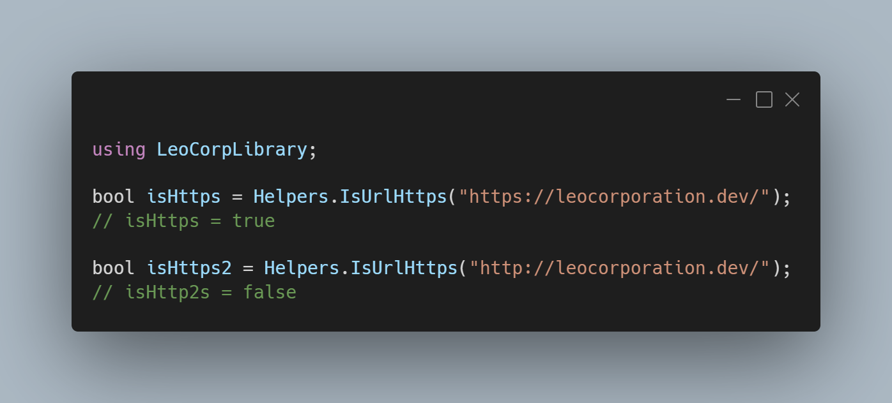

A new version of LeoCorpLibrary is now available and it is the version 3.11.0.2110.

## Changelog
### New
- Added the possibility to check if a link is valid (#256)
- Added the possibility to get the protocol of an URL (#257)
- Added the possibility to check if an URL is using HTTPS (#258)
- Added the possibility to check if a number is an integer (#259)
### Updated
- Refactored the IsEven() method (#260)
- Updated XML Documentation

## Links

- [NuGet –LeoCorpLibrary](https://www.nuget.org/packages/LeoCorpLibrary)
- [NuGet – LeoCorpLibrary.Core](https://www.nuget.org/packages/LeoCorpLibrary.Core)
- [GitHub](https://github.com/Leo-Corporation/LeoCorpLibrary)
- [GitHub Packages – LeoCorpLibrary](https://github.com/Leo-Corporation/LeoCorpLibrary/packages/345951?version=4.9.0.2208)
- [GitHub Packages – LeoCorpLibrary.Core](https://github.com/Leo-Corporation/LeoCorpLibrary/packages/530093?version=4.9.0.2208)

## Documentation

[Click here](https://leocorplibrary.leocorporation.dev/) to check the documentation of LeoCorpLibrary.

## Screenshot
