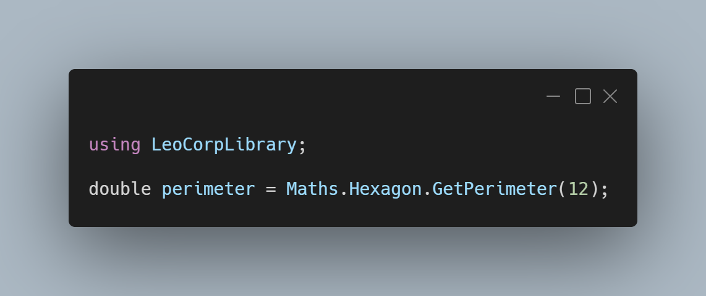

A new version of LeoCorpLibrary and LeoCorpLibrary.Core is now available.

## Changelog - LeoCorpLibrary
### New
- Added the possibility to upper the first letter of a string (#175)
- Added the possibility to get a triangle's hypotenuse (#176)
- Added the possibility to get a rectangle's diagonal (#177)
- Added the possibility to get a diamond's perimeter (#178)
- Added the possibility to get a diamond's area (#179)
- Added the possibility to get a diamond's area (#179)
- Added the possibility to get a hexagon's perimeter (#180)
- Added the possibility to get a hexagon's area (#181)

## Changelog - LeoCorpLibrary.Core
### New
- Added and updated XML Documentation
- Added the possibility to upper the first letter of a string (#175)
- Added the possibility to get a triangle's hypotenuse (#176)
- Added the possibility to get a rectangle's diagonal (#177)
- Added the possibility to get a diamond's perimeter (#178)
- Added the possibility to get a diamond's area (#179)
- Added the possibility to get a diamond's area (#179)
- Added the possibility to get a hexagon's perimeter (#180)
- Added the possibility to get a hexagon's area (#181)

## Links

- [NuGet –LeoCorpLibrary](https://www.nuget.org/packages/LeoCorpLibrary)
- [NuGet – LeoCorpLibrary.Core](https://www.nuget.org/packages/LeoCorpLibrary.Core)
- [GitHub](https://github.com/Leo-Corporation/LeoCorpLibrary)
- [GitHub Packages – LeoCorpLibrary](https://github.com/Leo-Corporation/LeoCorpLibrary/packages/345951)
- [GitHub Packages – LeoCorpLibrary.Core](https://github.com/Leo-Corporation/LeoCorpLibrary/packages/530093)

## Screenshot

