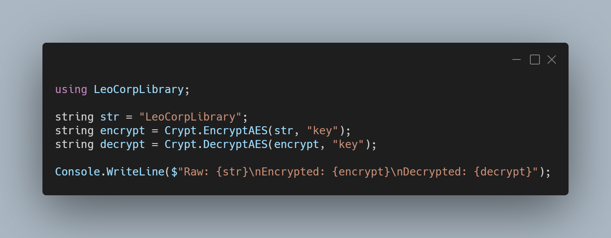

A new version of LeoCorpLibrary is now available, and it's the version 3.3.0.2102

## Changelog
### New
- Added the possibility to encrypt a string with RSA encryption (#184)
- Added the possibility to decrypt a string with RSA encryption (#184)
- Added the possibility to encrypt a string with AES encryption (#185)
- Added the possibility to decrypt a string with AES encryption (#185)
- Added exceptions to encrypt/decrypt methods (#184/#185)
- Added exceptions to encrypt/decrypt methods (#184/#185)
- Added a method that converts byte[] into string (#186)
### Fixed
- Fixed RSA encryption fails (#186)

## Links

- [NuGet –LeoCorpLibrary](https://www.nuget.org/packages/LeoCorpLibrary)
- [NuGet – LeoCorpLibrary.Core](https://www.nuget.org/packages/LeoCorpLibrary.Core)
- [GitHub](https://github.com/Leo-Corporation/LeoCorpLibrary)
- [GitHub Packages – LeoCorpLibrary](https://github.com/Leo-Corporation/LeoCorpLibrary/packages/345951)
- [GitHub Packages – LeoCorpLibrary.Core](https://github.com/Leo-Corporation/LeoCorpLibrary/packages/530093)

## Screenshot

