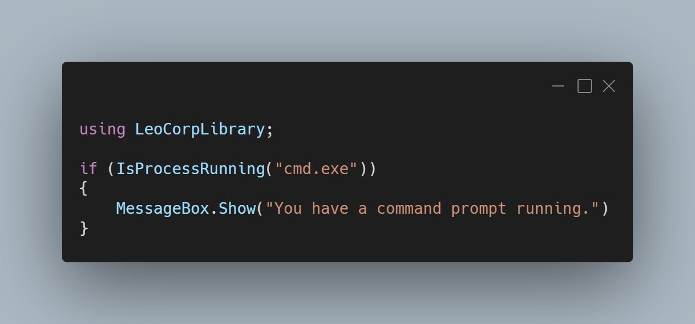

A new version of LeoCorpLibrary and LeoCorpLibrary.Core is now available, and it's the version 3.4.0.2103.

## Changelog
### New
- Added the possibility to get the cursor position (#188)*
- Added the possibility to get the cursor position for WPF (#188)*
- Added the possibility to convert UnixTime into a DateTime object (#190)
- Added the possibility to check if a process is running (#191)
- Added the possibility to check if a string is ending with the correct punctuation (#192)
- Added checks to handle exceptions
### Fixed
- Fixed: The UpperLettersAt() method doesn't work (#195)

_*This change is only included for LeoCorpLibrary and is not available in LeoCorpLibrary.Core._

## Links

- [NuGet –LeoCorpLibrary](https://www.nuget.org/packages/LeoCorpLibrary)
- [NuGet – LeoCorpLibrary.Core](https://www.nuget.org/packages/LeoCorpLibrary.Core)
- [GitHub](https://github.com/Leo-Corporation/LeoCorpLibrary)
- [GitHub Packages – LeoCorpLibrary](https://github.com/Leo-Corporation/LeoCorpLibrary/packages/345951)
- [GitHub Packages – LeoCorpLibrary.Core](https://github.com/Leo-Corporation/LeoCorpLibrary/packages/530093)

## Screenshot

