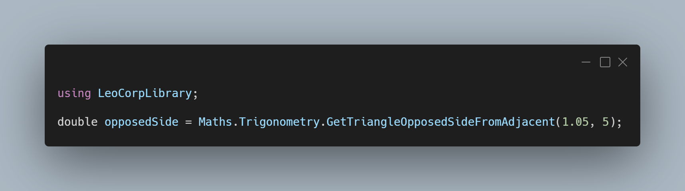

 A new version of LeoCorpLibrary is now available, and it’s the version 3.5.0.2104.

## Changelog
### New
- Added XML documentation
- Added the possibility to get a triangle's opposed side from an angle and its hypotenuse (#197)
- Added the possibility to get a triangle's opposed side from an angle and its adjacent side (#197)
- Added the possibility to get a triangle's adjacent side from an angle and its hypotenuse (#198)
- Added the possibility to get a triangle's adjacent side from an angle and its opposed side (#198)
- Added the possibility to get a triangle's hypotenuse from an angle and its opposed side (#199)
- Added the possibility to get a triangle's hypotenuse from an angle and its adjacent side (#199)
- Added the possibility to convert radians to degrees (#200)- Added the possibility to convert degrees to radians (#200)

## Links

- [NuGet –LeoCorpLibrary](https://www.nuget.org/packages/LeoCorpLibrary)
- [NuGet – LeoCorpLibrary.Core](https://www.nuget.org/packages/LeoCorpLibrary.Core)
- [GitHub](https://github.com/Leo-Corporation/LeoCorpLibrary)
- [GitHub Packages – LeoCorpLibrary](https://github.com/Leo-Corporation/LeoCorpLibrary/packages/345951)
- [GitHub Packages – LeoCorpLibrary.Core](https://github.com/Leo-Corporation/LeoCorpLibrary/packages/530093)

## Screenshot

