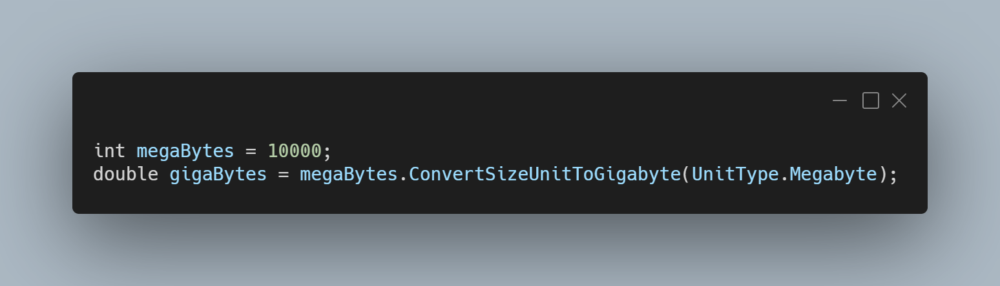

A new version is available for LeoCorpLibrary and LeoCorpLibrary.Core, and it is the version 3.6.0.2105.

## Changelog
### New
- Added the possibility to split lines in a string (#204)
- Added the possibility to convert a size unit to byte (#205)
- Added the possibility to convert a size unit to kilobyte (#205)
- Added the possibility to convert a size unit to megabyte (#205)
- Added the possibility to convert a size unit to gigabyte (#205)
- Added the possibility to convert a size unit to terabyte (#205)
- Added the possibility to convert a size unit to petabyte (#205)
- Added the possibility to "Unsplit" a string array (#206)
- Added a logger (#207)
- Added a variation to the logger (#207)

## Links

- [NuGet –LeoCorpLibrary](https://www.nuget.org/packages/LeoCorpLibrary)
- [NuGet – LeoCorpLibrary.Core](https://www.nuget.org/packages/LeoCorpLibrary.Core)
- [GitHub](https://github.com/Leo-Corporation/LeoCorpLibrary)
- [GitHub Packages – LeoCorpLibrary](https://github.com/Leo-Corporation/LeoCorpLibrary/packages/345951)
- [GitHub Packages – LeoCorpLibrary.Core](https://github.com/Leo-Corporation/LeoCorpLibrary/packages/530093)

## Screenshot

