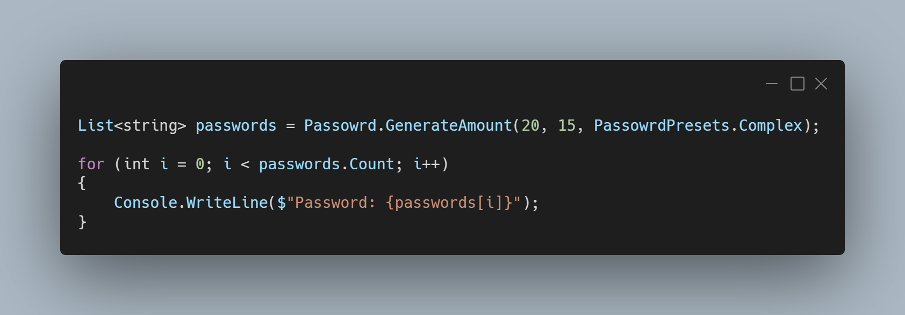

A new version of LeoCorpLibrary and LeoCorpLibrary.Core is available, and it is the version 3.7.0.2106.

## Changelog for LeoCorpLibrary
### New
- Added the possibility to get the DPI of the screen for WinForms (#212)
- Added the possibility to get the DPI of the screen for WPF (#212)
- Added the possibility to get the scale of the screen for WinForms (#213)
- Added the possibility to get the scale of the screen for WPF (#213)
- Added the possibility to generate multiple passwords (#215)
- Added a variation of the possibility to generate multiple passwords (#215)
- Added the possibility to generate multiple passwords asynchronously (#215)
- Added the possibility to check permissions of a directory (#216)
### Fixed
- Fixed an issue when logging text to a file in a new directory, an error is thrown (#214)
- Fixed typo issue: "lenght" to "length"

## Changelog for LeoCorpLibrary.Core
### New
- Added the possibility to generate multiple passwords (#215)
- Added a variation of the possibility to generate multiple passwords (#215)
- Added the possibility to generate multiple passwords asynchronously (#215)
- Added the possibility to check permissions of a directory (#216)
### Fixed
- Fixed an issue when logging text to a file in a new directory, an error is thrown (#214)
- Fixed typo issue: "lenght" to "length"

## Links

- [NuGet –LeoCorpLibrary](https://www.nuget.org/packages/LeoCorpLibrary)
- [NuGet – LeoCorpLibrary.Core](https://www.nuget.org/packages/LeoCorpLibrary.Core)
- [GitHub](https://github.com/Leo-Corporation/LeoCorpLibrary)
- [GitHub Packages – LeoCorpLibrary](https://github.com/Leo-Corporation/LeoCorpLibrary/packages/345951)
- [GitHub Packages – LeoCorpLibrary.Core](https://github.com/Leo-Corporation/LeoCorpLibrary/packages/530093)

## Screenshot

