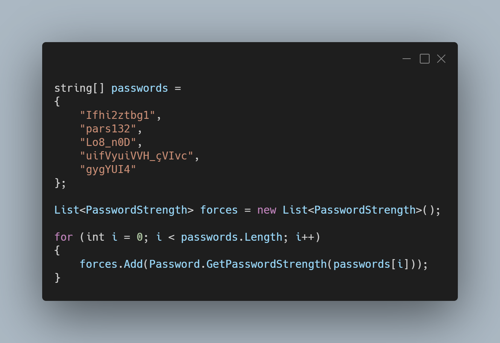

A new version of LeoCorpLibrary is now available, and it is the version 3.8.0.2107.

## Changelog
### New
- Added XML documentation
- Added to SplitLines() new splitters: \r, \r\n (#224)
- Added PasswordStrength enum (#225)
- Added HasRepeatedCharacters() method
- Added Passliss' password strength system (#225)
- Added Passliss' password strength system (#225)
- Added the possibility to get the area of a sphere (#226)
- Added the possibility to get the volume of a sphere (#227)

## Links

- [NuGet –LeoCorpLibrary](https://www.nuget.org/packages/LeoCorpLibrary)
- [NuGet – LeoCorpLibrary.Core](https://www.nuget.org/packages/LeoCorpLibrary.Core)
- [GitHub](https://github.com/Leo-Corporation/LeoCorpLibrary)
- [GitHub Packages – LeoCorpLibrary](https://github.com/Leo-Corporation/LeoCorpLibrary/packages/345951)
- [GitHub Packages – LeoCorpLibrary.Core](https://github.com/Leo-Corporation/LeoCorpLibrary/packages/530093)

## Screenshot
