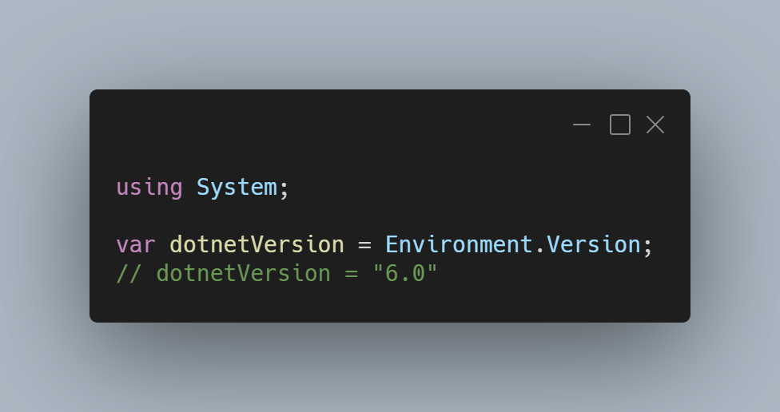

A new version of LeoCorpLibrary is now available and it is the version 4.0.0.2111.

## Changelog
### New
- Replaced WebClient with HttpClient if possible (#266)
- Made GetLastVersion() obsolete (#266)
- Added support for .NET 6 (#267)
- Unified supported frameworks between LeoCorpLibrary and LeoCorpLibrary.Core (#268)
- Fixed compatibility issues
- Fixed .NET 6 related issues (#270)

## Links

- [NuGet –LeoCorpLibrary](https://www.nuget.org/packages/LeoCorpLibrary)
- [NuGet – LeoCorpLibrary.Core](https://www.nuget.org/packages/LeoCorpLibrary.Core)
- [GitHub](https://github.com/Leo-Corporation/LeoCorpLibrary)
- [GitHub Packages – LeoCorpLibrary](https://github.com/Leo-Corporation/LeoCorpLibrary/packages/345951)
- [GitHub Packages – LeoCorpLibrary.Core](https://github.com/Leo-Corporation/LeoCorpLibrary/packages/530093)

## Image
