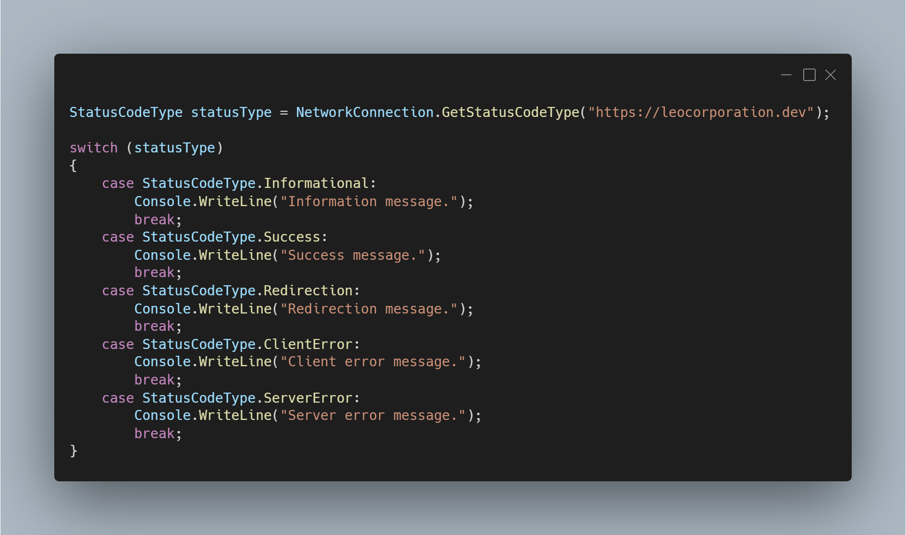

A new version of LeoCorpLibrary is now available, and it is the version 4.1.0.2112.

## Changelog
### New
- Added support for Windows 11 for GetWindowsVersion() method (#273)
- Added the possibility to get the status code of web page (#274)
- Added the possibility to get the status description of web page (#275)
- Added StatusCodeType enum (#276)
- Added the possibility to get the status code "type" (#276)
### Updated
- Updated IsAvailable() method in NetworkConnection (#277)
- Merged IsAvailableTestSite() and IsAvailable() into one method (#278)
- Made IsAvailableTestSite() method obsolete (#278)
- Updated XML Documentation (#279)

## Links

- [NuGet –LeoCorpLibrary](https://www.nuget.org/packages/LeoCorpLibrary)
- [NuGet – LeoCorpLibrary.Core](https://www.nuget.org/packages/LeoCorpLibrary.Core)
- [GitHub](https://github.com/Leo-Corporation/LeoCorpLibrary)
- [GitHub Packages – LeoCorpLibrary](https://github.com/Leo-Corporation/LeoCorpLibrary/packages/345951)
- [GitHub Packages – LeoCorpLibrary.Core](https://github.com/Leo-Corporation/LeoCorpLibrary/packages/530093)

## Image
