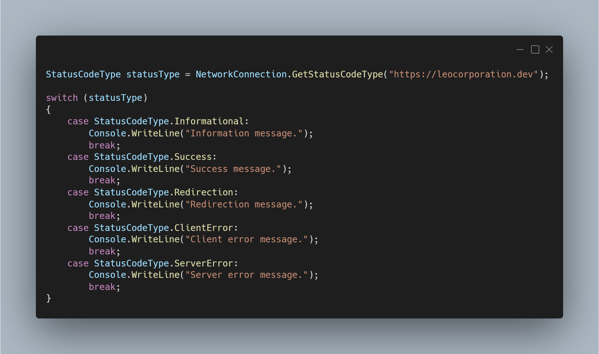

A new version is now available for both LeoCorpLibrary and LeoCorpLibrary.Core, and it is version 4.2.0.2201.

## Changelog
### New
- Added the possibility to get the system theme (#285) (Not available in LeoCorpLibrary.Core)
- Added the possibility to get if the current Windows version supports dark theme (#286)
- Added the possibility to get the opposite of a number (#287)
- Added the possibility to get the factorial of a number (#288)
### Updated
- Updated XML Documentation

## Links

- [NuGet –LeoCorpLibrary](https://www.nuget.org/packages/LeoCorpLibrary)
- [NuGet – LeoCorpLibrary.Core](https://www.nuget.org/packages/LeoCorpLibrary.Core)
- [GitHub](https://github.com/Leo-Corporation/LeoCorpLibrary)
- [GitHub Packages – LeoCorpLibrary](https://github.com/Leo-Corporation/LeoCorpLibrary/packages/345951)
- [GitHub Packages – LeoCorpLibrary.Core](https://github.com/Leo-Corporation/LeoCorpLibrary/packages/530093)

## Screenshot
