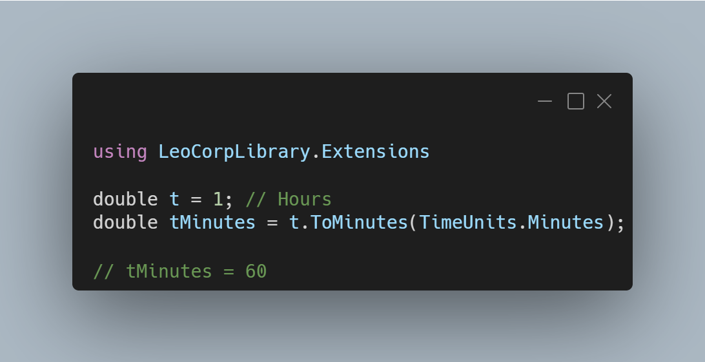

A new version of LeoCorpLibrary is now available, and it is the version 4.3.0.2202.

## Changelog
### New
- Added the possibility to convert a time unit to seconds (#293)
- Added the possibility to convert a time unit to minutes (#294)
- Added the possibility to convert a time unit to hours (#295)
- Added the possibility to convert a time unit to days (#296)
- Added the possibility to get the divisors of a specific number (#297)
- Added XML Documentation

## Links

- [NuGet –LeoCorpLibrary](https://www.nuget.org/packages/LeoCorpLibrary)
- [NuGet – LeoCorpLibrary.Core](https://www.nuget.org/packages/LeoCorpLibrary.Core)
- [GitHub](https://github.com/Leo-Corporation/LeoCorpLibrary)
- [GitHub Packages – LeoCorpLibrary](https://github.com/Leo-Corporation/LeoCorpLibrary/packages/345951)
- [GitHub Packages – LeoCorpLibrary.Core](https://github.com/Leo-Corporation/LeoCorpLibrary/packages/530093)

## Screenshot

