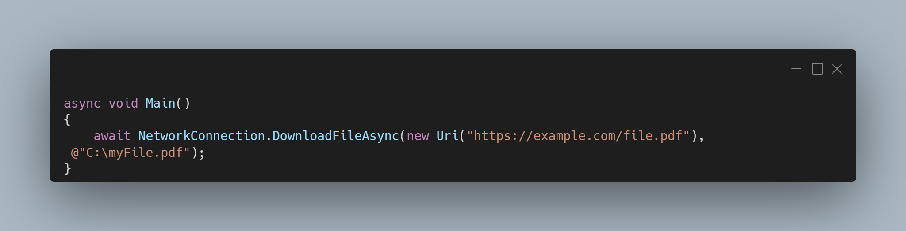

A new version of LeoCorpLibrary is now available, and it is the version 4.4.0.2203.

## Changelog
### New
- Added time conversions methods to UnitsConversions class (#302)
- Added storage units conversion methods to UnitsConversions class (#303)
- Moved all enumerations to a dedicated namespace (#304)
- Added the possibility to download a file using an HttpClient (#305)
### Updated
- Updated XML Documentation

## Links

- [NuGet –LeoCorpLibrary](https://www.nuget.org/packages/LeoCorpLibrary)
- [NuGet – LeoCorpLibrary.Core](https://www.nuget.org/packages/LeoCorpLibrary.Core)
- [GitHub](https://github.com/Leo-Corporation/LeoCorpLibrary)
- [GitHub Packages – LeoCorpLibrary](https://github.com/Leo-Corporation/LeoCorpLibrary/packages/345951?version=4.9.0.2208)
- [GitHub Packages – LeoCorpLibrary.Core](https://github.com/Leo-Corporation/LeoCorpLibrary/packages/530093?version=4.9.0.2208)

## Documentation

[Click here](https://leocorplibrary.leocorporation.dev/) to check the documentation of LeoCorpLibrary.

## Screenshot
