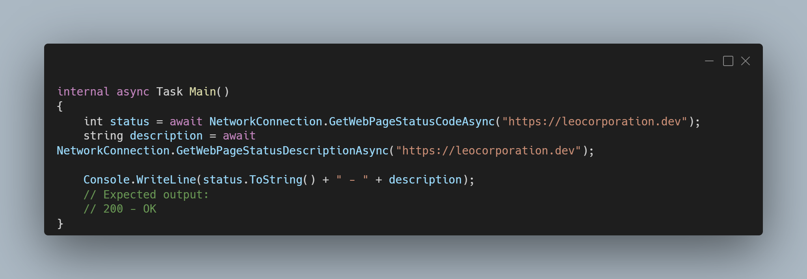

A new version of LeoCorpLibrary is now available and it is the version 4.5.0.2204.

## Changelog
### New
- Added GetWebPageStatusCode() method (#311)
- Made GetWebPageStatusCode() method obsolete (#311)
- Added XML Documentation
- Added GetWebPageStatusDescriptionAsync() method (#312)
- Made GetWebPageStatusDescription() method obsolete (#312)
### Fixed
- Fixed XML comment issue
- Updated GetWebPageStatusDescription() method (#312)
### Removed
- Removed obsolete methods (#312)
- Removed null argument check in GetUnixTime() method (#313)
### Updated
- Updated Encrypt() method (#310)
- Updated Decrypt() method (#310)
- Updated Crypt methods (#310)
- Updated GetWebPageStatusCode() method (#311)

## Links

- [NuGet –LeoCorpLibrary](https://www.nuget.org/packages/LeoCorpLibrary)
- [NuGet – LeoCorpLibrary.Core](https://www.nuget.org/packages/LeoCorpLibrary.Core)
- [GitHub](https://github.com/Leo-Corporation/LeoCorpLibrary)
- [GitHub Packages – LeoCorpLibrary](https://github.com/Leo-Corporation/LeoCorpLibrary/packages/345951?version=4.9.0.2208)
- [GitHub Packages – LeoCorpLibrary.Core](https://github.com/Leo-Corporation/LeoCorpLibrary/packages/530093?version=4.9.0.2208)

## Documentation

[Click here](https://leocorplibrary.leocorporation.dev/) to see the documentation of LeoCorpLibrary.

## Image
