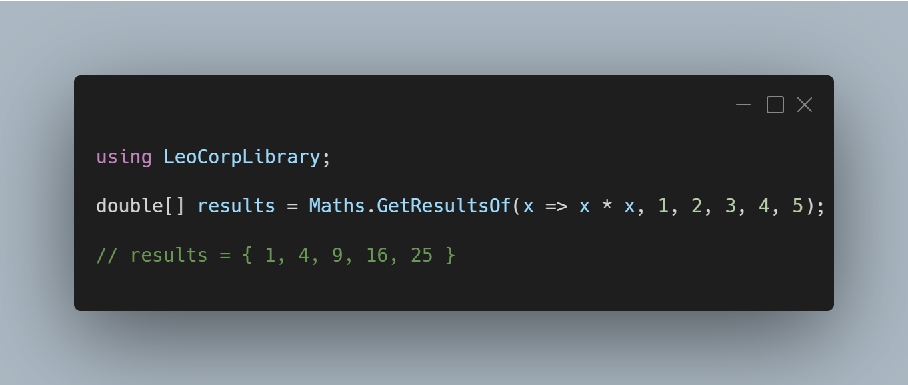

A new version of LeoCorpLibrary is now available, and it is the version 4.6.0.2205.

## Changelog
### New
- Added the possibility to get the positive of a number (#318)
- Added the possibility to get the negative of a number (#319)
- Added GetResultsOf() method (#320)

## Documentation

[Click here](https://leocorplibrary.leocorporation.dev/) to check the documentation of LeoCorpLibrary.

## Links

- [NuGet –LeoCorpLibrary](https://www.nuget.org/packages/LeoCorpLibrary)
- [NuGet – LeoCorpLibrary.Core](https://www.nuget.org/packages/LeoCorpLibrary.Core)
- [GitHub](https://github.com/Leo-Corporation/LeoCorpLibrary)
- [GitHub Packages – LeoCorpLibrary](https://github.com/Leo-Corporation/LeoCorpLibrary/packages/345951)
- [GitHub Packages – LeoCorpLibrary.Core](https://github.com/Leo-Corporation/LeoCorpLibrary/packages/530093)

## Screenshot
