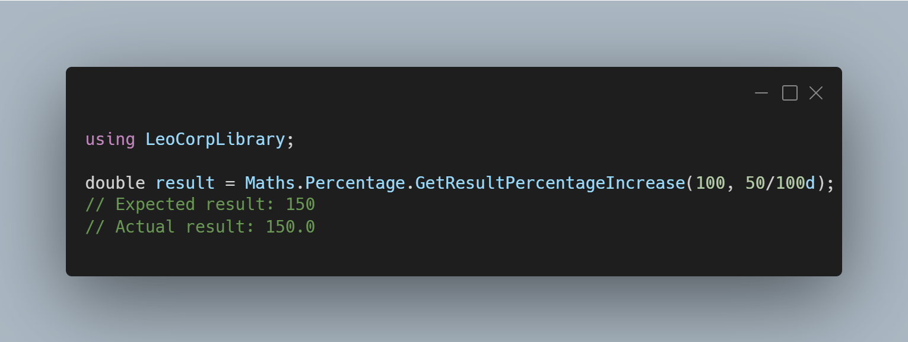

A new version of LeoCorpLibrary is now available, and it is the version 4.7.0.2206.

## Changelog
### New
- Added the possibility to get the result of a percentage increase (#324)
- Added the possibility to get the result of a percentage decrease (#325)
- Added the possibility to get the evolution rate that cancel itself (#326)
- Added the possibility to convert a proportion to a percentage string (#327)
- Added the possibility to check if a number is positive or negative (#328)
- Added IsPositive() method (#329)
- Added IsNegative() method (#330)

## Links

- [NuGet –LeoCorpLibrary](https://www.nuget.org/packages/LeoCorpLibrary)
- [NuGet – LeoCorpLibrary.Core](https://www.nuget.org/packages/LeoCorpLibrary.Core)
- [GitHub](https://github.com/Leo-Corporation/LeoCorpLibrary)
- [GitHub Packages – LeoCorpLibrary](https://github.com/Leo-Corporation/LeoCorpLibrary/packages/345951)
- [GitHub Packages – LeoCorpLibrary.Core](https://github.com/Leo-Corporation/LeoCorpLibrary/packages/530093)

## Documentation

[Click here](https://leocorplibrary.leocorporation.dev/) to check the documentation of LeoCorpLibrary.

## Screenshot
