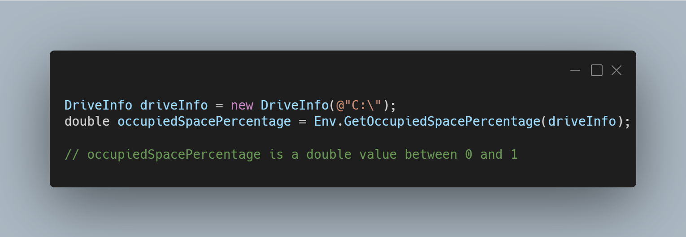

A new version of LeoCorpLibrary is now available, and it is the version 4.8.0.2207.

## Changelog
### New
- Added the possibility to convert a DateTime to UnixTime (#336)
- Added the possibility to convert Double to Int (#337)
- Added the possibility to get the current directory of the app (#338)
- Added the possibility to get the percentage of occupied space on a drive (#339)
- Added XML Documentation (#340)

## Documentation

Click here to access the documentation of LeoCorpLibrary.

## Links

- [NuGet –LeoCorpLibrary](https://www.nuget.org/packages/LeoCorpLibrary)
- [NuGet – LeoCorpLibrary.Core](https://www.nuget.org/packages/LeoCorpLibrary.Core)
- [GitHub](https://github.com/Leo-Corporation/LeoCorpLibrary)
- [GitHub Packages – LeoCorpLibrary](https://github.com/Leo-Corporation/LeoCorpLibrary/packages/345951)
- [GitHub Packages – LeoCorpLibrary.Core](https://github.com/Leo-Corporation/LeoCorpLibrary/packages/530093)

## Screenshot
