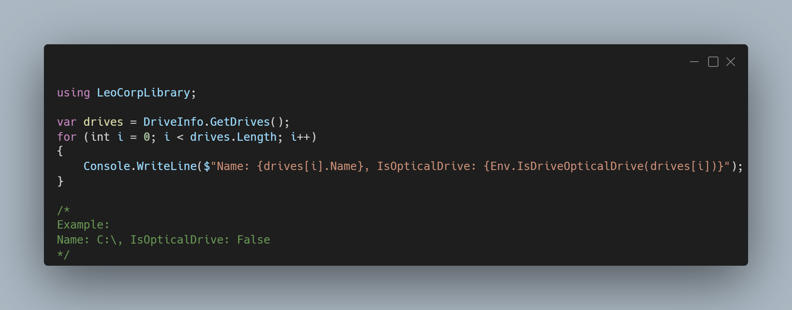

A new version of LeoCorpLibrary is now available, and it is the version 4.9.0.2208.

## Changelog
### New
- Added the possibility to get the drive with the highest free space (#345)
- Added the possibility to get the drive with the lowest free space (#346)
- Added XML Documentation
- Added the possibility to get the UnitType of a drive (#347)
- Added the possibility to get if the device has an optical disc device (#348)
### Fixed
- Fixed: GetDriveWithHighestFreeSpace() doesn't work with optical drives (#350)

## Documentation

Click here to access the LeoCorpLibrary documentation.

## Links

- [NuGet –LeoCorpLibrary](https://www.nuget.org/packages/LeoCorpLibrary)
- [NuGet – LeoCorpLibrary.Core](https://www.nuget.org/packages/LeoCorpLibrary.Core)
- [GitHub](https://github.com/Leo-Corporation/LeoCorpLibrary)
- [GitHub Packages – LeoCorpLibrary](https://github.com/Leo-Corporation/LeoCorpLibrary/packages/345951?version=4.9.0.2208)
- [GitHub Packages – LeoCorpLibrary.Core](https://github.com/Leo-Corporation/LeoCorpLibrary/packages/530093?version=4.9.0.2208)

## Screenshot

