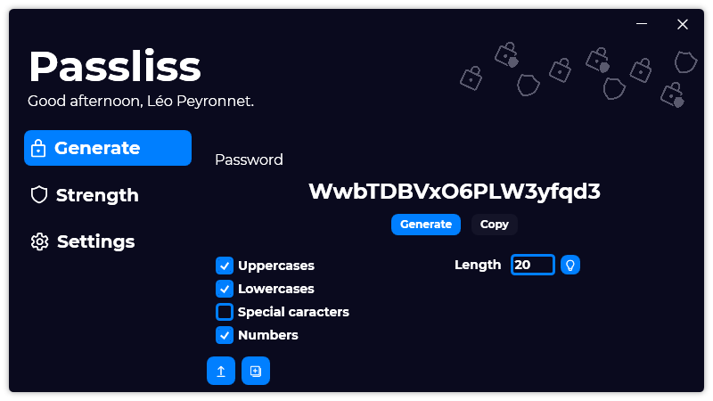
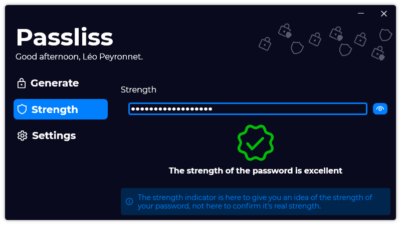

A new version is available for Passliss, and it's the version 1.1.0.2103.

## Changelog
### New
- Replace the "Theme" ComboBox to RadioButtons (#14)
- Added a "Licenses" section in the "Settings" page (#14)
- Added a "Random length" button (#16)
- Added the possibility to hide the password in the "Strength" page (#17)
### Fixed
- Fixed: In the "LoadPasswordConfiguration" window, the textblock is still black in dark theme (#12)
- Fixed: Comboboxes in Settings in dark theme are unreadable (#13)
### Updated
- Updated translations
- Updated LeoCorpLibrary
- Refactorization of code

## Download
[Click here](https://www.mediafire.com/file/ohcs00n2nv6zocn/PasslissSetup.exe/file) to download Passliss.

## Screenshots

