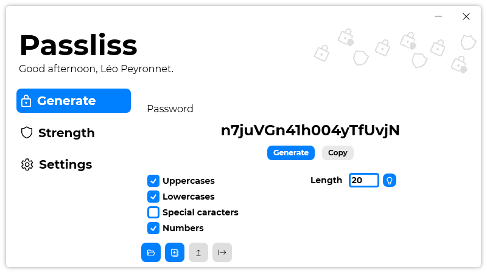
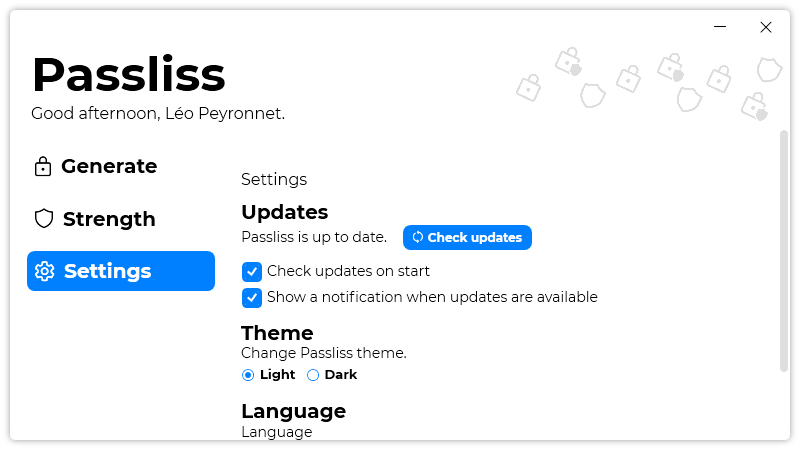
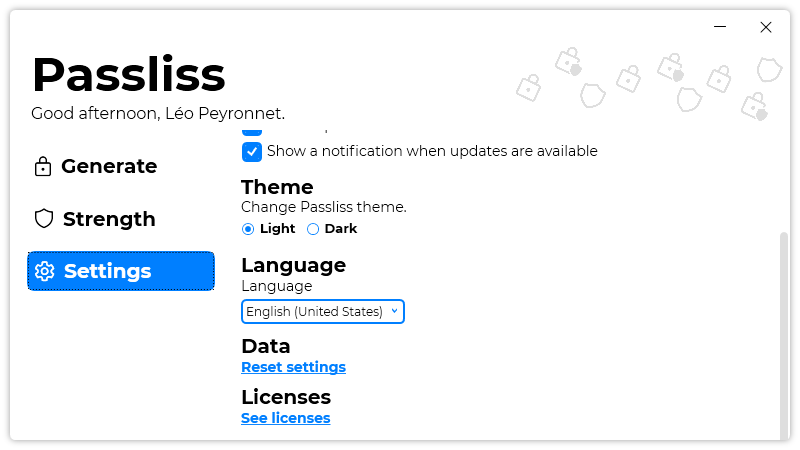

A new version is available for Passliss, and it is the version 1.2.0.2104.

## Changelog
### New
- Added a notification when updates are available (#21)
- Added the possibility to set if Passliss should check updates on start (#22)
- Added the possibility to export Password Configurations (#23)
- Added the possibility to import Password Configurations (#23)
- Added tooltips on buttons (#23)
- Added the possibility to reset settings (#24)
### Fixed
- Fixed: Passliss crashes if there isn't internet (#20)
### Updated
- Updated translations
- Updated LeoCorpLibrary
- Updated icons (#23)
- The "Load Password Configuration" popup will now behave just like a context menu

## Download

[Click here](https://tinyurl.com/Passliss) to download Passliss.

## Screenshots

