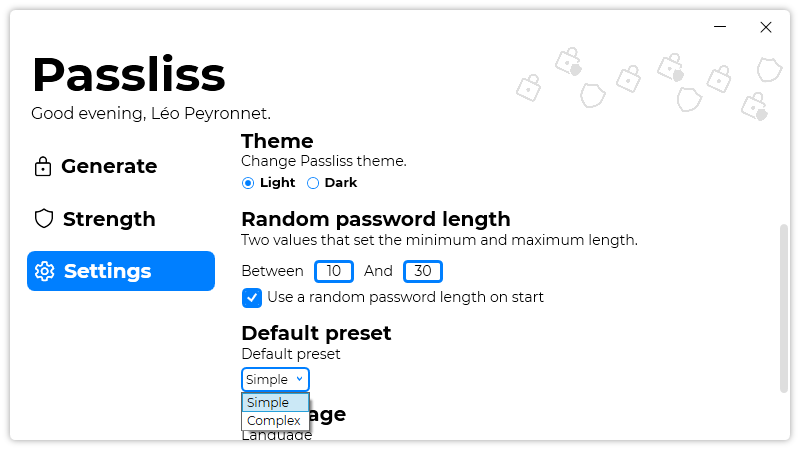

A new version of Passliss is now available, and it is the version 1.3.0.2105.

## Changelog
### New
- Improved the dark theme color of Import/Export Password Configurations (#28)
- Added translations- Added the possibility to set a default preset (#29)
- Added the possibility to edit the default preset (#29)
- Added the possibility to edit random length values (#30)
- Added the possibility to use a random length value on start (#31)
### Updated
- Updated LeoCorpLibrary

## Download

[Click here](https://tinyurl.com/Passliss) to download Passliss.

## Screenshot
