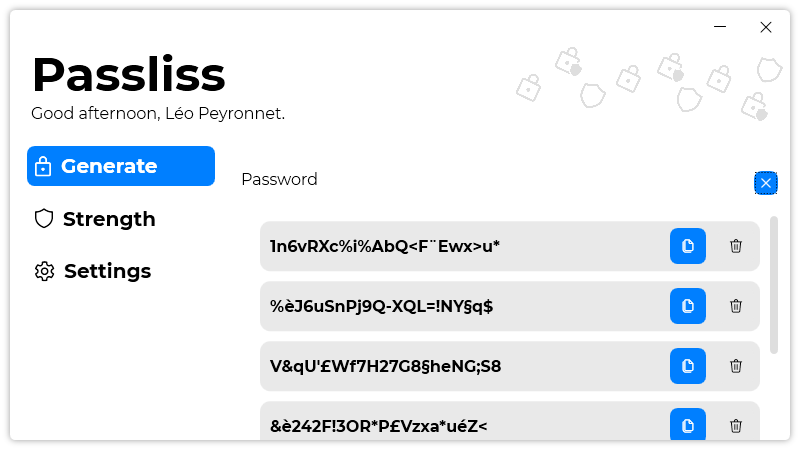

A new version of Passliss is now available and it is the version 1.4.0.2106.

## Changelog
### New
- Redesigned "About" section in settings (#35)
- Added the possibility to export settings (#36)
- Added the possibility to import settings (#36)
- Added translations
- Added an historic of generated passwords (#37)
### Updated
- Updated LeoCorpLibrary

## Download

[Click here](https://tinyurl.com/Passliss) to download Passliss.

## Screenshot

