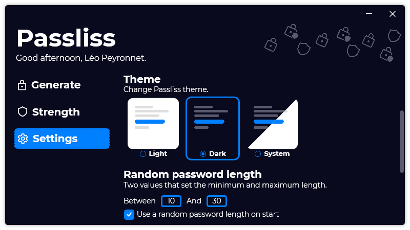

A new version of Passliss is available, and it is the version 1.5.0.2107.

## Changelog
### New
- Added translations
- Added the possibility to set the theme to system (#45)
- Redesigned the theme picking UI (#46)
- Added the possibility to set the default startup page (#47)
- Added a "Randomize" button on the length field in the Password Configurations creator UI (#48)
### Updated
- Improved theme assets (#46)
- Updated LeoCorpLibrary

## Download

[Click here](https://tinyurl.com/Passliss) to download Passliss.

## Screenshot

