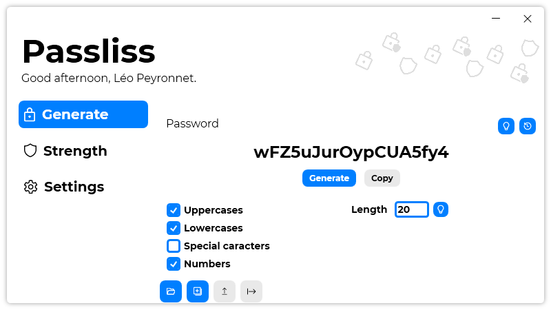

A new version of Passliss is now available, and it is the version 1.6.0.2108.

## Changelog
### New
- Added the possibility to set a default Password Configuration (#56)
- Added translations
- Removed "Presets" section (#57)
- Added the possibility to reset the default Password Configuration (#57)
- Added a "Randomize" button (#58)
- Added animations on Tab buttons (#61)
### Updated
- Updated LeoCorpLibrary
- Updated Setup

## Download

[Click here](https://tinyurl.com/Passliss) to download Passliss.

## Screenshot

