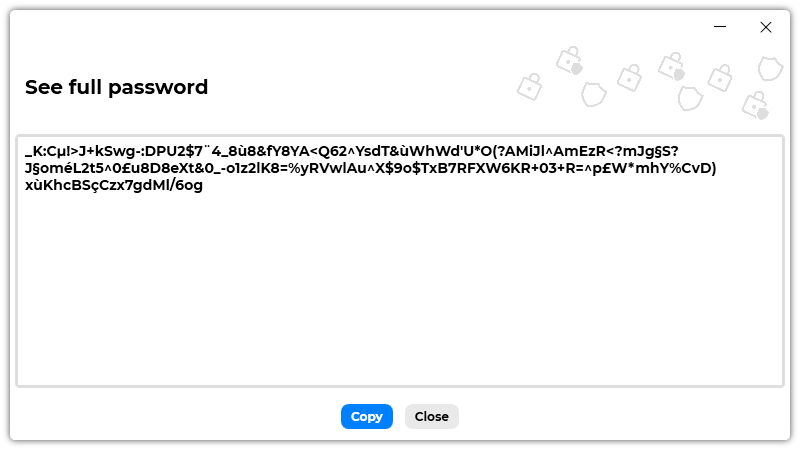

A new version of Passliss is now available and it is the version 1.7.0.2109.

## Changelog
### New
- Added the possibility to edit a Password Configuration (#68)
- Added translations
- Added a window to see long passwords (#69)
- Added a button in "Generate" page that opens the "See full password" window" (#69)
### Fixed
- Fixed: Forecolor is wrong in light mode in Password Configuration Item (#66)
- Fixed: The "star" icon isn't updated on start (#67)
### Updated
- Made default theme "System" (#70)

## Download

[Click here](https://tinyurl.com/Passliss) to download Passliss.

## Screenshot

