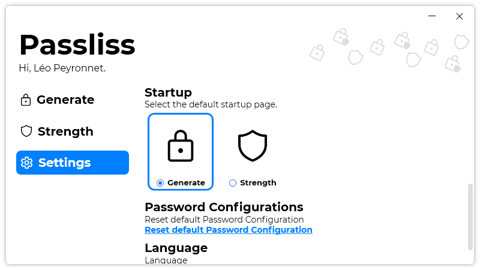

A new version of Passliss is now available, and it is the version 1.8.0.2110.

## Changelog
### New
- Changed "Strength" page icons to filled icons (#78)
- The "History" button is hidden when the history is empty (#79)
- Redesigned "Startup page" section in "Settings" page (#80)
- Added tooltips on "icons-only" buttons (#81)
- Made the TextBox in "See full Password" window read-only (#82)
### Fixed
- Fixed an issue where icons weren't visible (#78)
### Updated
- Updated LeoCorpLibrary
- Updated "Stregnth" page "Very good" icon (#78)

## Download

[Click here](https://tinyurl.com/Passliss) to download Passliss.

## Screenshot
