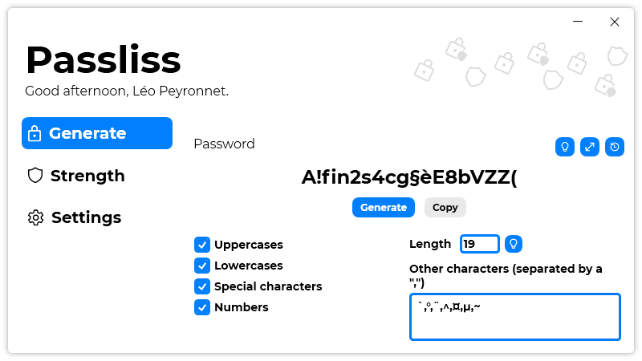

A new version of Passliss is now available, and it is the version 1.9.0.2111.

## Changelog
### New
- Added the possibility to hide password by default in "Strength" page (#88)
- Added an option in "Settings" page to hide/show password in "Strength" (#88)
- Added the possibility to mask/show password in "History" (#89)
- The "Hide/Show password" button is only visible when the history is open (#89)
- Added the possibility to always hide generated password in "History" (#90)
- Added an option in "Settings" page to hide/show password in history (#90)
- Added a textbox to add other characters (#91)
- Added the possibility to add other characters (#91)
### Fixed
- Fixed: "Caracters" should be "Characters" (#87)
### Updated
- Updated LeoCorpLibrary

## Download

[Click here](https://tinyurl.com/Passliss) to download Passliss.

## Screenshot
