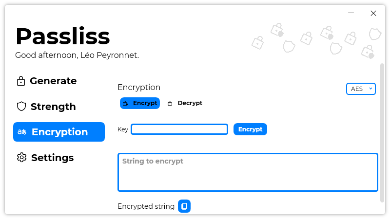

A new version of Passliss is now available, and it is the version 2.0.0.2112.

## Changelog
### New
- Redesigned links (#99)
- Added translations
- Added an "Encrypt" page (#100)
- Added the possibility to encrypt a string with a key using AES encryption (#101)
- Improved the design of the "Encryption" page (#100)- Added a placeholder on the "String to encrypt" TextBox (#100)
- Added messages when some fields are empty (#100)
- Added the possibility to encrypt a string with a key using Triple-DES encryption (#102)
- Added the possibility to copy the encrypted string
- Added a tab system (#100)
- Added the possibility to decrypt a string using AES encryption (#103)
- Add the possibility to decrypt a string using Triple-DES encryption (#104)
- Added error messages in case of an error
- Added the possibility to set the "Encryption" page as a startup page
### Fixed
- Fixed: Can't see the "Licenses" section (#98)
- Fixed an issue with system theme not working on Windows 11
- Fixed format issues
- Fixed an issue with dark theme
- Fixed scroll bar issues (#100)
### Updated
- Updated LeoCorpLibrary

## Download

[Click here](https://tinyurl.com/Passliss) to download Passliss.

## Image
