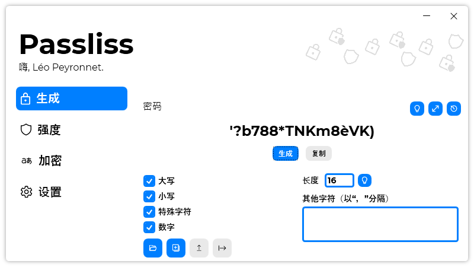

A new version of Passliss is now available, and it is the version 2.1.0.2201.

## Changelog
### New
- Added description- Added tooltips on "Copy" buttons in "Crypt" page (#117)
- Added translations (#118)
- Added the possibility to disable the history (#118)
- Added Simplified Chinese translation (#120) (Thanks to @wcxu21)
- Passliss no longer checks for updates on start by default (#121)
- Added a message box that ask the user if they want automatic updates (#121)
### Fixed
- Fixed: The Password Configuration buttons aren't visible (#116)
- Fixed French translation typo (#119)
### Updated
- Updated LeoCorpLibrary
- Updated copyright
- Updated Licenses copyright(s) (#115)
- Refactored code

## Download

[Click here](https://tinyurl.com/Passliss) to download Passliss.

## Screenshot
