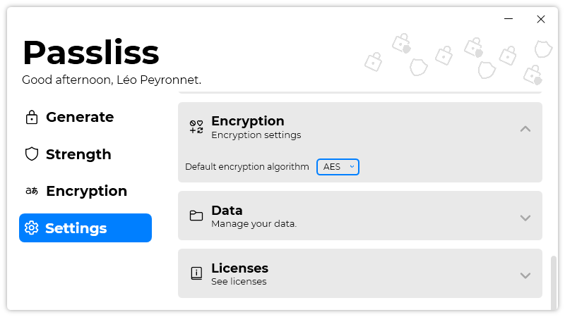

A new version of Passliss is now available, and it is the version 2.3.0.2203.

## Changelog
### New
- Improved animations on sidebar (#140)
- Added translations (#141)
- Added a "Generate key" button in "Encryption" page (#141)
- Added a "Test strength" button in "Generate" page (#142)
- Added the possibility to set a default encryption mode (#143)
- Added a "Slide in" animation when browsing Passliss (#144)
### Updated
- Updated LeoCorpLibrary
- Updated Setup
- Upgraded to .NET 6 (#139)
- Code cleanup for .NET 6

## Download

[Click here](https://tinyurl.com/Passliss) to download Passliss.

## Screenshot
