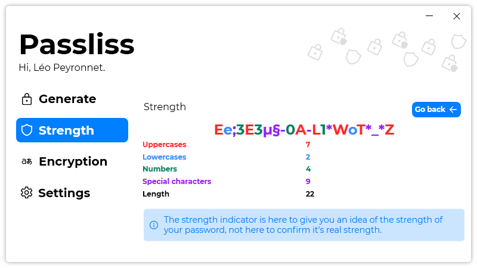

A new version of Passliss is now available, and it is the version 2.4.0.2204.

## Changelog
### New
- Moved "Import" and "Export" buttons (#152)
- Added translations (#153)
- Added "See more" section in "Strength" page (#153)
- Added more details in the "Strength" page (#153)
- The "See more" button is only visible when a password is provided (#153)
- Added new colors (#154)
- Added colors to "Strength" page (#154)
- Added syntax coloring in "Strength" page (#154)

### Fixed
- Fixed an issue with the icon of the "See more" button (#153)
- Fixed green color in light mode (#154)
- Fixed an issue with "Strength" page (#154)
- Fixed an issue when testing strength from "Generate" page

### Updated
- Updated LeoCorpLibrary
- Updated Chinese translation
- Replaced orange with green (#154)
- Refactored code

## Download

[Click here](https://tinyurl.com/Passliss) to download Passliss.

## Image
