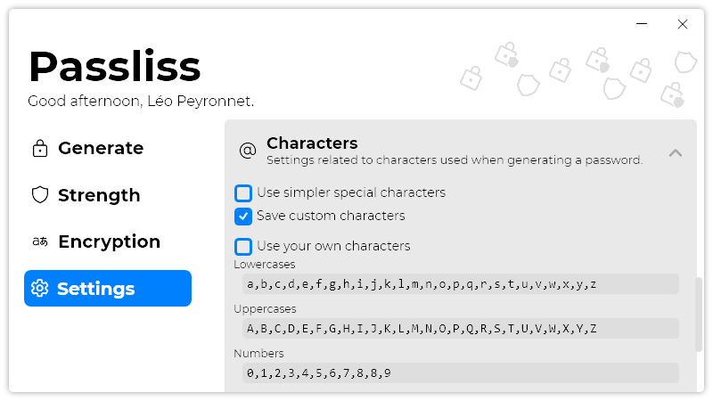

A new version of Passliss is now available, and it is the version 2.5.0.2206.

## Changelog
### New
- Added a strength indicator in "Generate" page (#163)
- Added translations (#164)
- Added taskbar jump list (#164)
- Added logic for taskbar jump lists (#164)
- Added "simpler" special characters (#165)
- Added translations (#165)
- Added the possibility to toggle simpler characters (#165)
- Added the possibility to save the user's custom characters (#166)
- Added the possibility to disable custom character save (#166)
- Added default characters (#167)
- Added TextBoxes to edit each character (#167)
- Added the possibility to set every default character (#167)
- Added the possibility to toggle user defined characters (#167)
- Added the possibility to edit every default character (#167)
### Fixed
- Fixed wrong Tooltip in "Strength" page button (#162)
- Fixed a typo in localized strings
- Fixed icon inconsistency
- Fixed text wrapping issues
### Updated
- Updated LeoCorpLibrary
- Updated localized strings (#166)
- Removed blank lines

## Download

[Click here](http://tinyurl.com/Passliss) to download Passliss.

## Learn more

[Click here](https://leocorporation.dev/store/passliss) to learn more about Passliss.

## Screenshot
