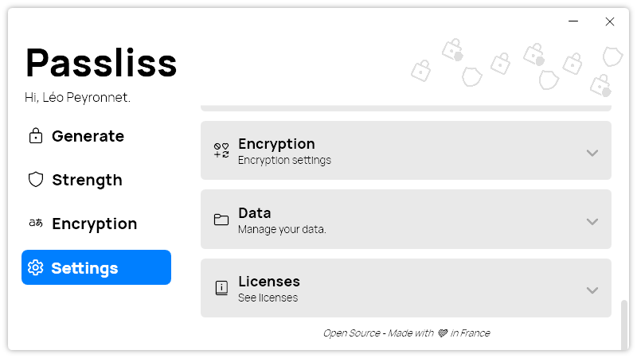

A small new version of Passliss is now available, and it is version 2.5.2.2207.

## Changelog

- Added font files (#176)
- Added translations (#179)
- Added Open-Source mention (#179)
- Updated LeoCorpLibrary
- Updated font (#176)
- Removed old font files (#176)

## Download

[Click here](http://tinyurl.com/Passliss) to download Passliss.

## Website

[Click here](https://leocorporation.dev/store/passliss) to learn more about Passliss.

## Screenshot
