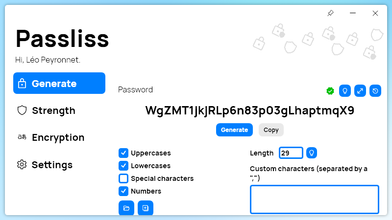

A new version of Passliss is now available, and it is the version 2.6.0.2209.

## Changelog
### New
- Added the possibility to pin the window (#184)
- The app is smoother when exiting it (#186)

### Fixed
- Fixed crash issue with update system (#187)
- Fixed hovering issue

### Updated
- Updated LeoCorpLibrary
- Merged the strength indicator with button (#183)
- Updated button style to secondary style in Strength (#185)
- Updated button style to secondary style in Crypt (#185)

## Download

[Click here](http://tinyurl.com/Passliss) to download Passliss.

## Website

[Click here](https://leocorporation.dev/store/passliss) to learn more about Passliss.

## Screenshot
