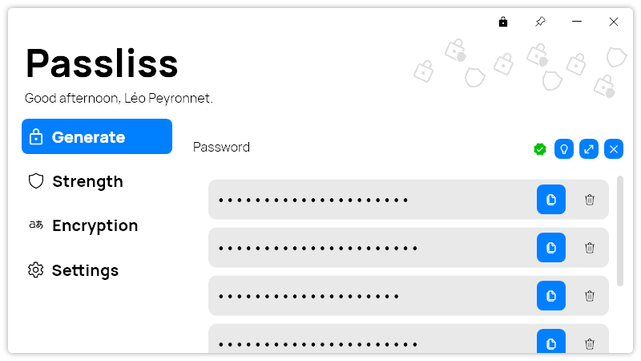

A new version of Passliss is now available, and it is the version 2.7.0.2211.

## Changelog
### New
- Added "Confidential Mode" (#193)
- Added translations (#193)
- Added the possibility to toggle on Confidential mode on start (#193)
- Added translations (#194)
- Added the possibility to generate multiple passwords (#194)
- Merged the "New" and "Load" buttons (#195)

### Fixed
- Fixed: Font isn't applied in Password Configuration (#192)
- Fixed an issue with Confidential mode (#193)

### Updated
- Removed old windows (#195)
- Replaced LeoCorpLibrary with PeyrSharp (#196)

## Download

[Click here](http://tinyurl.com/Passliss) to download Passliss.

## Website

[Click here](https://leocorporation.dev/store/passliss) to learn more about Passliss.

## Screenshot
