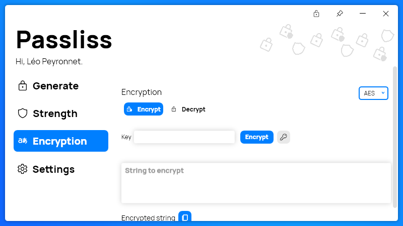

A new version of Passliss is now available, and it is the version 2.8.0.2212.

## Changelog
### New
- Redesigned TextBoxes (#206)
- Added translations (#207)
- Added tooltips on the title bar buttons (#207)
- Improved the "characters" textboxes in dark mode (#208)

### Updated
- Updated PeyrSharp.Env (#204)
- Updated PeyrSharp.Core (#205)
- Updated theme resources (#206)
- Updated TextBox style (#206)

## Download

[Click here](http://tinyurl.com/Passliss) to download Passliss.

## Website

[Click here](https://leocorporation.dev/store/passliss) to learn more about Passliss.

## Screenshot
