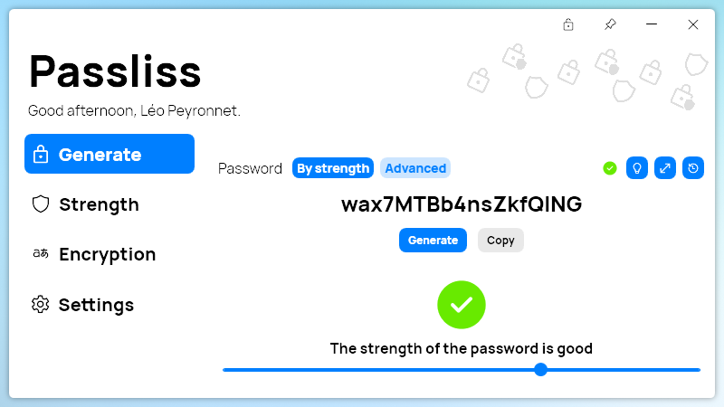

A new version of Passliss is now available, and it is the version 2.9.0.2302.

# What's new?
## Changelog
### New
- Added the possibility to generate a password by strength (#218)
- Added the "By strength" section (#219)
- Added the "Advanced" section (#220)
- Improved padding (#220)
- Added translations (#221)
- Added the possibility to set the default password strength (#221)

### Updated
- Updated PeyrSharp.Core (#216)
- Updated PeyrSharp.Env (#217)
- Updated copyright (#222)
- Updated Licenses (#222)

## Generate by strength

With Passliss 2.9, we are introducing a new way to generate easily passwords by simply providing Passliss with a target strength, making it easier to generate strong passwords. The old options are still available under the "Advanced" section of the Generate page.

## Download

[Click here](http://tinyurl.com/Passliss) to download Passliss.

## Website

[Click here](https://leocorporation.dev/store/passliss) to learn more about Passliss.

## Quick demo
Watch a quick demo about the new Generate by strength feature.



<iframe width="560" height="315" src="https://www.youtube.com/embed/Go1TSXRaJ18" title="YouTube video player" frameborder="0" allow="accelerometer; autoplay; clipboard-write; encrypted-media; gyroscope; picture-in-picture; web-share" allowfullscreen></iframe>

