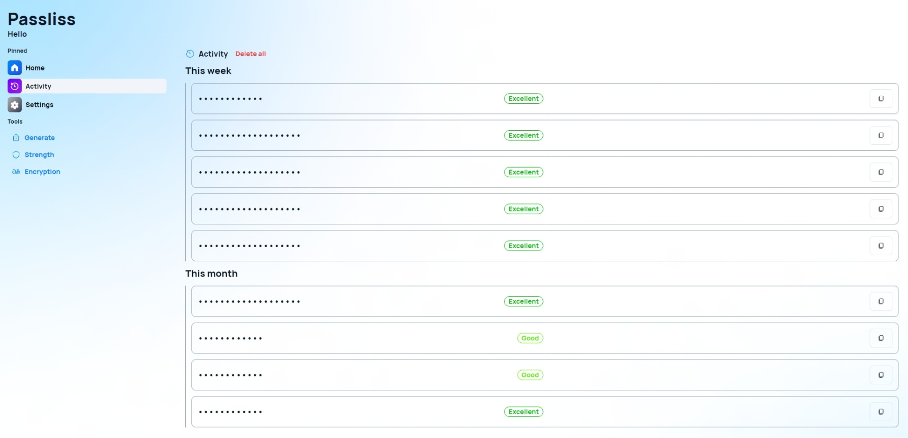

A new version of Passliss is now available, and it is the version 3.1.0.2304.

# What's new?

## Changelog

### New

- Added translations (#267)
- Added Hide password settings system (#267)
- Added Hide password section in Settings (#267)
- Added the possibility to hide the generated passwords (#267)
- Added password box for the key field in "Encryption" (#268)

### Fixed

- Fixed: The dashboard items should be centered on mobile devices (#266)

### Updated

- Updated dependencies

## Launch

[Click here](https://passliss.leocorporation.dev/) to launch Passliss in your web browser.

## Screenshot

