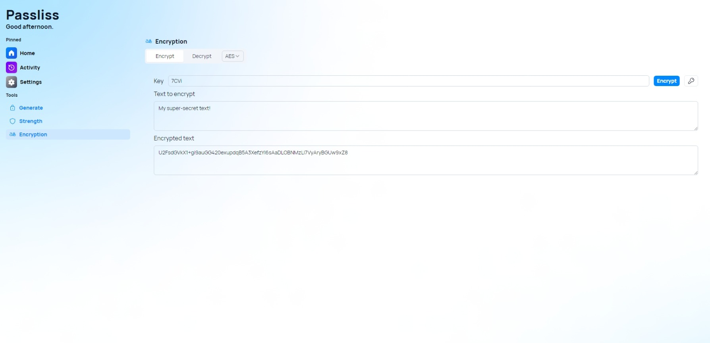

A new version of Passliss is now available, and it is the version 3.2.0.2305.

# What's new?

## Changelog

### New

- Added the possibility to remember the value in Encryption (#316)
- Added the possibility to remember the value in Generate (simple) (#316)
- Added the possibility to remember the value in Generate (advanced) (#316)

### Fixed

- Fixed TailwindCSS class order warning messages
- Fixed meta tags

### Updated

- Removed Lucide react icons (#315)
- Removed old header
- Removed old theme toggle
- _Updated dependencies_

## Launch

[Click here](https://passliss.leocorporation.dev/) to launch Passliss in your web browser.

## Screenshot

