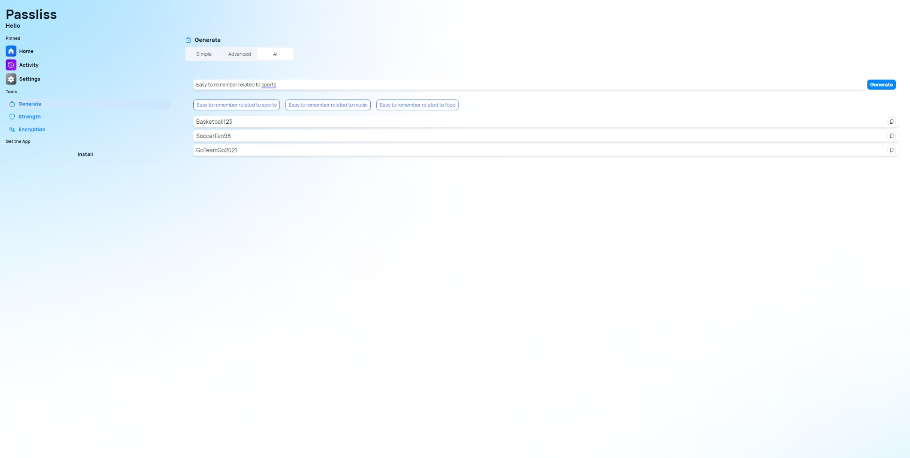

A new version of Passliss is now available, and it is the version 3.3.0.2307. This version brings an exciting feature to Passliss: AI Password Generation!

# What's new?

## Changelog

### New

- Added translations (#432)
- Added Password item component (#432)
- Added AI section in Generate page (#432)
- Added the possibility to set the OpenAI API key (#433)
- Added the possibility to generate a password with AI (#432)
- Added suggestions for new users (#434)
- Added UI when no API key is provided
- Added a loading UI (#435)

### Fixed

- Fixed an issue with AI settings
- Fixed an issue when the response isn't properly formatted

### Updated

- Improved design of prompt item
- _Updated dependencies_

## Introducing AI password generation

If you are like most people, you probably have dozens of online accounts that require passwords. And if you are like most people, you probably use the same password or a few variations of it for all your accounts. This is a bad practice that can compromise your security and privacy. But creating and remembering strong and unique passwords for each account is not easy either. That's why we added artificial intelligence for password generation in Passliss, to create secure and memorable passwords for you.

Passliss is powered by OpenAI's GPT-3.5, one of the most advanced language model in the world. GPT-3.5 can generate natural and coherent text on any topic, given some keywords or a prompt. We use this technology to generate passwords that are not only strong and random, but also meaningful and easy to remember.

How does it work? It's simple. Just go to our [website](passliss.leocorporation.dev) and enter a prompt that is related to the account you want to create a password for. For example, if you want to create a password for your Netflix account, you can enter something like "I love watching movies and shows on Netflix". Then, click on the "Generate" button and wait for a few seconds. Passliss will generate three passwords based on your prompt, each with a different level of security and memorability. You can choose the one that suits your needs best, or generate more passwords if you are not satisfied.

Here are some examples of passwords generated by Passliss:

**Prompt:** I love watching movies and shows on Netflix

Passwords:

- M0v13L0v3r!
- N3tf1xAddict@
- Str34m1ngQu33n!

**Prompt:** My favorite sport is soccer and I play every weekend

Passwords:

- S0cc3rW33k3nd
- Fav0rit3Sp0rt!2O2O
- PlayS0cc3rZzZ

**Prompt:** I am a fan of Harry Potter and my favorite character is Hermione

Passwords:

- H3rmi0n3P0tter
- Grang3rW1zard
- Mudbl00dGryffind0r

As you can see, Passliss can generate passwords that are related to your interests and hobbies, making them easier to recall. Of course, you should always use a password manager to store and manage your passwords securely. Passliss is not a password manager, but a password generator that can help you create better passwords.

We hope you will enjoy using Passliss new AI capabilities. We are always working to improve our app and make it more user-friendly and reliable. Note that to use this new feature, you will need an [OpenAI API key](https://platform.openai.com/account/api-keys).

## Launch

[Click here](https://passliss.leocorporation.dev/) to launch Passliss in your web browser.
