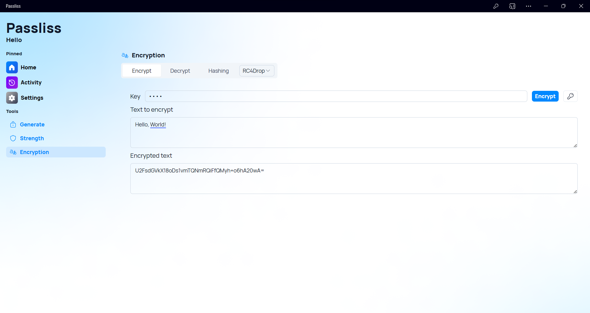
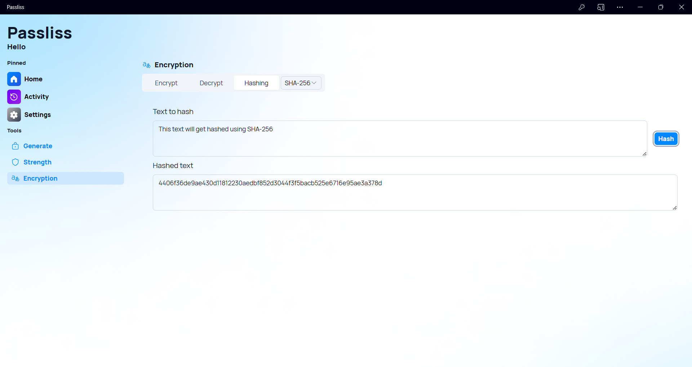

A new version of Passliss is now available and brings new encryption and hashing features to existing ones.

## New encryption options

We are introducing some new features to enhance Passliss' encryption capabilities. Users can now choose from two new algorithm options for encryption: Rabbit and RC4Drop. These algorithms are fast, secure and easy to use. They complement the existing encryption options of AES and Triple-DES.

## New hashing section

In addition, we added a new hashing section in the encryption page of the app. Users can now apply one of the following hashing algorithms to text: MD5, SHA-1 or SHA-256. Hashing is a process that transforms text or a password into a fixed-length string of characters, making it harder to crack. Hashing also helps to verify the integrity of the password and prevent tampering.

These new features make Passliss a more versatile and powerful password generator app. Users can customize their passwords according to their preferences and security needs.

## Changelog
### New
- Added Rabbit cypher for encryption (#486)
- Added RC4Drop cypher for encryption (#487)
- Added the possibility to set new cyphers as default option (#488)
- Added locales (#489)
- Added MD5 Hashing algorithm (#489)
- Added SHA-1 Hashing algorithm (#490)
- Added SHA-256 Hashing algorithm (#491)
- Added the possibility to set the default hashing algorithm (#492)

### Updated
- _Updated dependencies_

## Launch

[Click here](https://passliss.leocorporation.dev/) to launch Passliss in your web browser.
