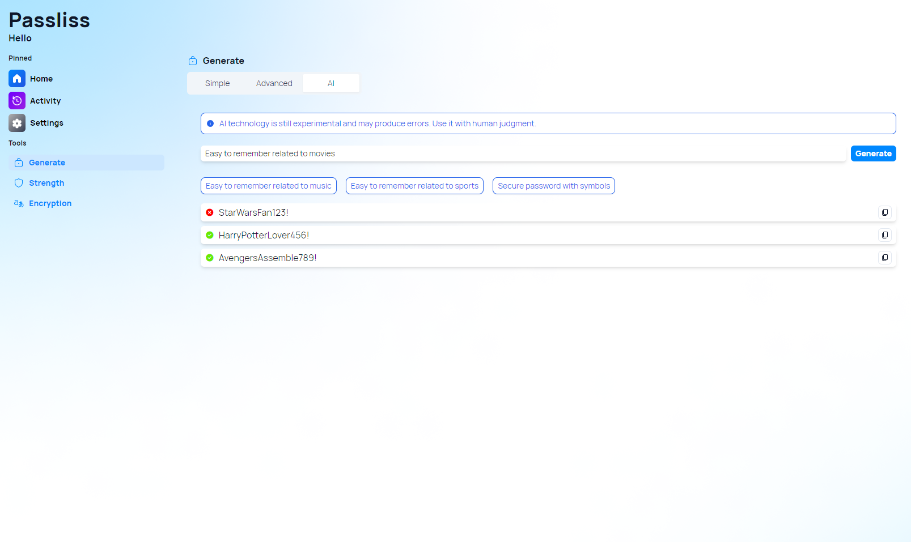
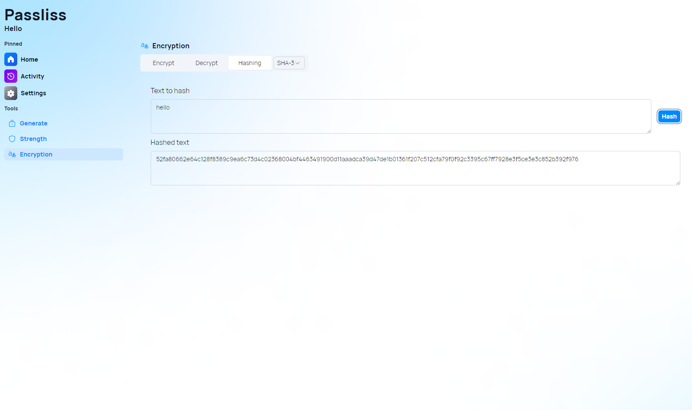

A new version of Passliss is now available and brings hashing options alongside with some improvements.

## Improvements to AI Generation

### Disclaimer banner

One of the most notable changes in this version is the addition of a warning banner in AI generation. This banner will alert users to the fact that AI technology is still experimental and may produce errors. We want to ensure that our users are aware of this and use the AI-generated passwords with caution.

### New strength icon

Another new feature is the addition of a strength icon in the AI-generated passwords. This icon will provide a visual indication of the strength of the password, making it easier for users to choose a strong and secure password.

## New hashing algorithm options

In addition to these changes, we have also added two new hashing algorithms: SHA-512 and SHA-3. These algorithms are now available as options for the default algorithm, giving users more flexibility in choosing the hashing algorithm that best suits their needs.

## Changelog

### New

- Added a warning banner in AI generation (#553)
- Added a strength icon in the AI generated passwords (#554)
- Added SHA-512 Hashing algorithm (#555)
- Added SHA-512 as an option for default algorithm (#555)
- Added SHA-3 Hashing algorithm (#556)
- Added SHA-3 as an option for default algorithm (#555)

### Fixed

- Fixed wrong dialog message

### Updated

- _Updated dependencies_

## Launch

[Click here](https://passliss.leocorporation.dev/) to launch Passliss in your web browser.
