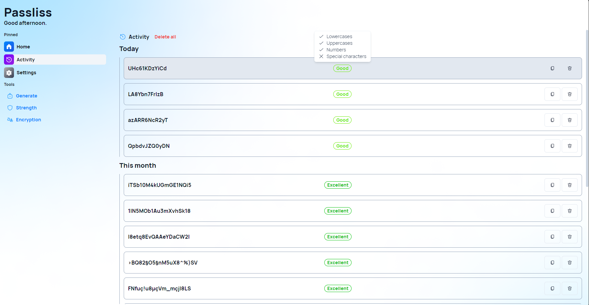
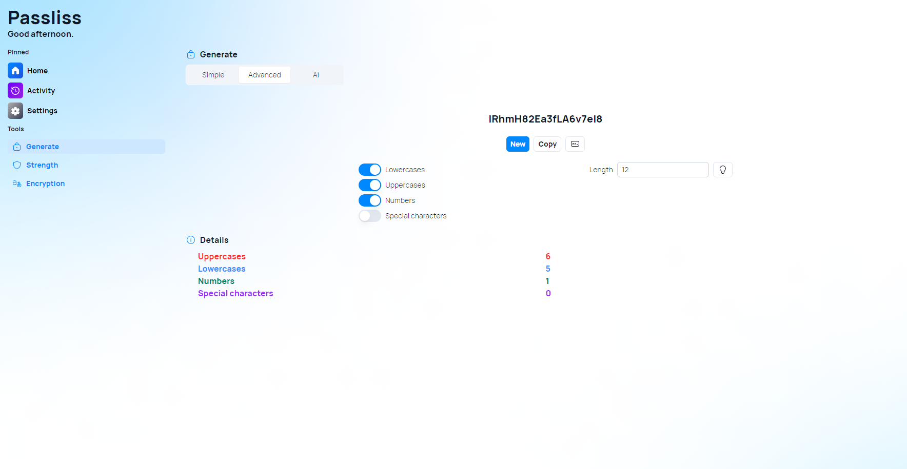

A new version of Passliss is now available and brings new features in the history page, as well as a new details section when "Advanced" mode is toggled in the Generate page.

## New history features

One of the new feature is the tooltips on the history page. The history page shows you a list of passwords that you have generated using Passliss. Now, when you hover over a password, you can see a tooltip that shows you some information about its strength. You can now know which criteria were used to evaluated the strength of a password. Plus, it is now possible to delete a specific item from history by clicking on the new "Delete" button, next to the "Copy" button.

## Details section in Generate page

Another new features is the details section in the advanced mode of the generate page. In this section, you can see a detailed breakdown of how your password is composed, such as the number of characters, symbols, digits, and uppercase and lowercase letters. This feature can help you understand how your password choices affect its security and memorability.

## Changelog

### New

- Added locales (#622)
- Add the possibility to remove a password from history (#622)
- Added tooltips in history (#623)
- Added details section (#624)
- Added new prompts for AI password generation (#625)

### Fixed

- Fixed middleware
- Fixed other classname issues
- Fixed config errors

### Updated

- Improved design on mobile (#624)
- _Updated dependencies_

## Launch

[Click here](https://passliss.leocorporation.dev/) to launch Passliss in your web browser.

## Learn more

[Click here](https://leocorporation.dev/store/passliss) to learn more about Passliss
