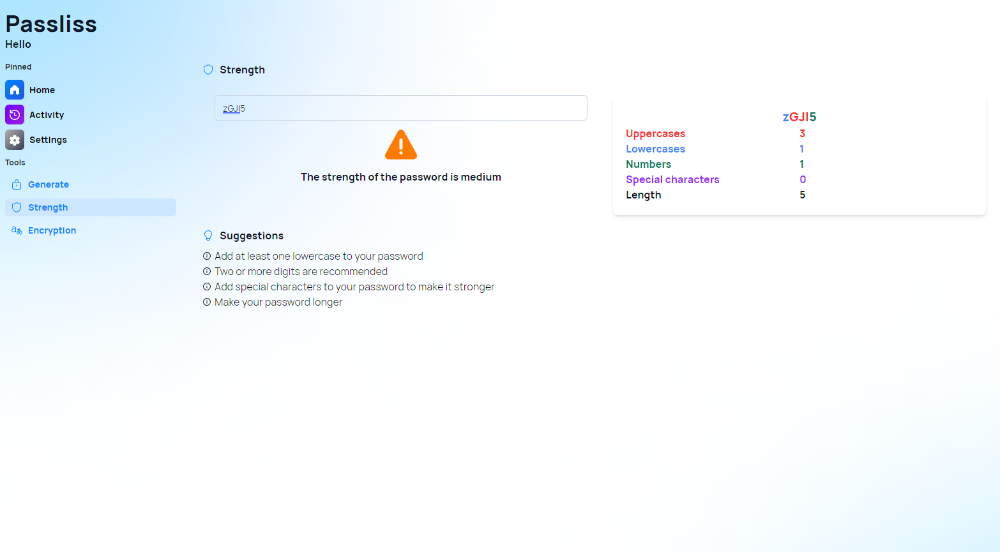

A new version of Passliss is available, and it brings a new suggestions panel in the Strength page, but also several improvements on the code base.

## Suggestion panel

If you want to create strong passwords that can protect your online accounts from hackers, you need to pay attention to the suggestion panel in the Strength page. This feature will analyze your password and give you feedback on how to make it more secure. You will see a score that indicates how strong your password is, as well as a list of suggestions on how to improve it. For example, you might be advised to use a longer password, mix uppercase and lowercase letters, add numbers and symbols, or avoid common words and patterns. By following these suggestions, you can increase the strength of your password and reduce the risk of being hacked.

## Changelog

### New

- Refactored Generate page (#679)
- Refactored Strength page (#679)
- Added the possibility to delete an activity item on mobile (#680)
- Added locales (#681)
- Added suggestion component (#681)
- Added suggestions to improve a password (#681)

### Updated

- _Updated dependencies_

## Launch

[Click here](https://passliss.leocorporation.dev/) to launch Passliss in your web browser.

## Learn more

[Click here](https://leocorporation.dev/store/passliss) to learn more about Passliss
