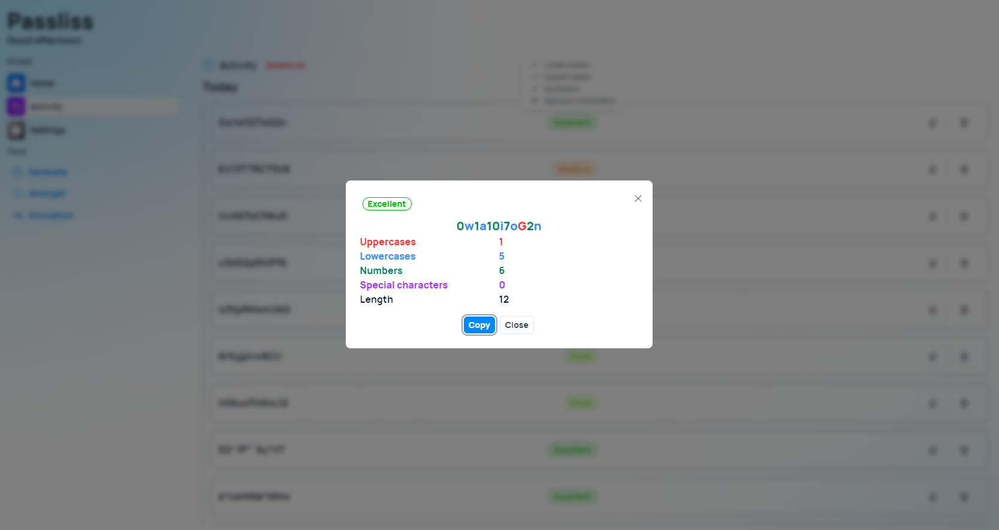
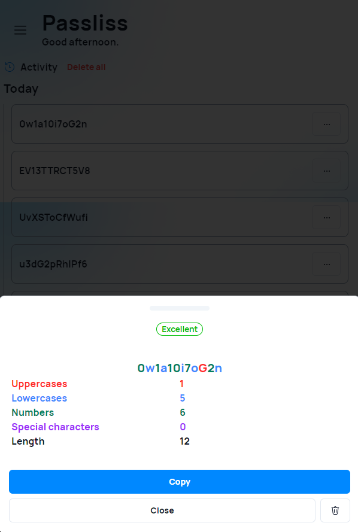

This new version of Passliss introduces several improvements to the UI of the app and new improvements for mobile users.

## New strength details in Activity

It is now possible to get detailed information about the strength of a password directly in the Activity page, just click on the strength indicator to get more information. On mobile devices, we redesigned the "More" button: Instead of a context menu, a drawer UI will now show up with detailed information about the password. At the bottom of the drawer, you will find different actions, such as "Copy", "Close" and "Delete".

## Changelog

### New

- Redesigned cards in Home page (#761)
- Improved AI page generation system (#762)
- Improved navigation bar buttons when selected (#763)
- Tooltips are now appearing instantaneously (#764)
- Added new locales (#764)
- Added new strength dialog (#764)
- Added Drawer component (#764)
- Added new theme colors
- Added new Drawer design on mobile (#764)

### Fixed

- Fixed an issue with shadow color in home page
- Fixed an issue when opening the drawer
- Fixed an issue with navigation bar

### Updated

- Updated copyright years (#765)
- _Updated dependencies_

## Launch

[Click here](https://passliss.leocorporation.dev/) to launch Passliss in your web browser.

## Learn more

[Click here](https://leocorporation.dev/store/passliss) to learn more about Passliss
