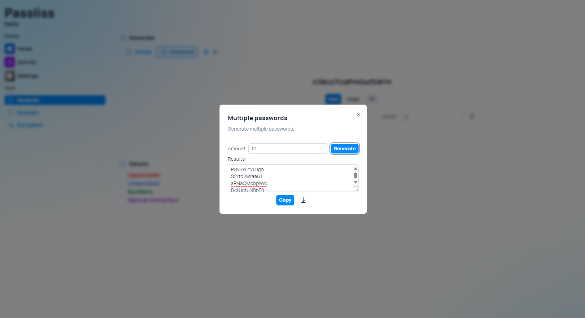
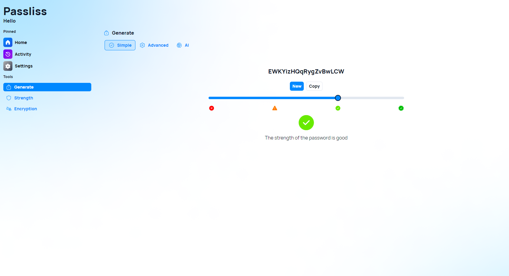

Version 3.9.0.2402 of Passliss has been released and it brings CSV password export features, and many other features.

## Export generated passwords as CSV

In the "Generate multiple passwords" feature, we made copying the generated passwords on mobile devices easier by adding a "Copy" button. Plus, there is now a new export button that allows you to export the generated passwords to a CSV file.

## Other UI Improvements

This version of Passliss introduces a new appearance for the tabs in the "Generate" and in the "Encryption" pages, as well as a new indicator in the "Simple" mode of the "Generate" page, making it easier for new users to understand how this feature works.

## Changelog

### New

- Added Strength indicators in Generate page (#771)
- Redesigned tabs component (#840)
- Redesigned tabs in Generate page (#840)
- Redesigned tabs in Encryption page (#840)
- Added copy button in "Multiple passwords" (#841)
- Added the possibility to export generated passwords to CSV (#842)

### Fixed

- Fixed an issue with hover effect on home cards

### Updated

- Improved margins in dialog
- _Updated dependencies_

## Launch

[Click here](https://passliss.leocorporation.dev/) to launch Passliss in your web browser.

## Learn more

[Click here](https://leocorporation.dev/store/passliss) to learn more about Passliss
