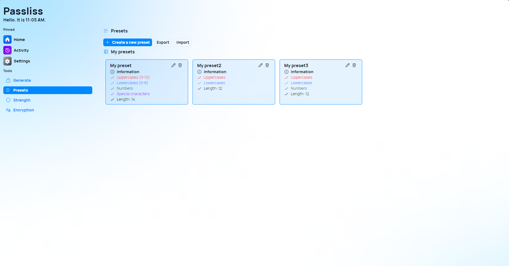
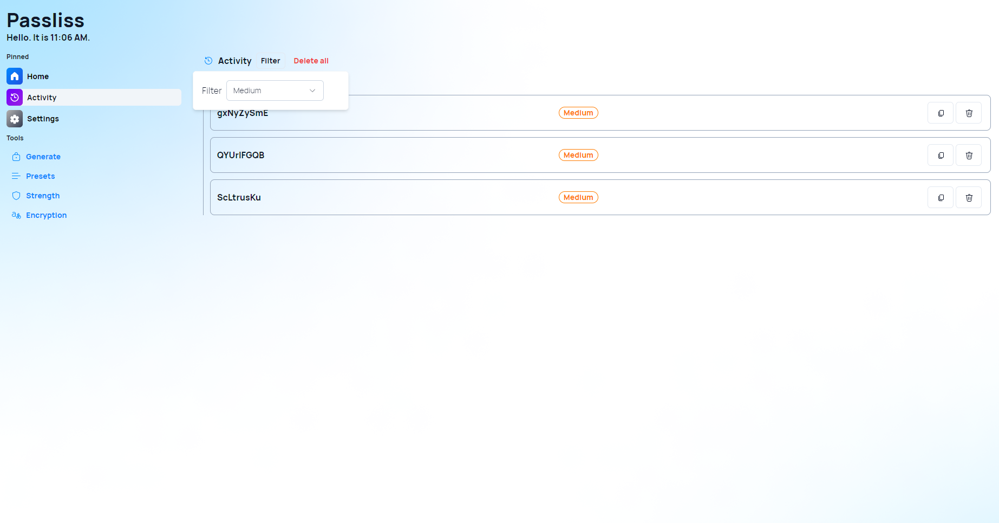

Version 4.1.0.2404 is now available for Passliss, and it brings several improvements to the password presets feature, but also new features for the activity page, and more!

## Improved Password Preset Experience

Starting with this new version of Passliss, you can now edit your presets without having to delete them and recreate them each time you want to make a modification. We also improve the user interface of the preset page to make it clearer and simpler to quickly understand the different properties of each preset. Finally, we also added the possibility to import and export password presets, so you can bring them to different machines more easily.

## Other improvements

With version 4.1.0.2404, we are introducing a new filter option in the Activity page. This feature allows you to only show passwords depending on their strength. We also made several other improvements and fixes to other ares of the app. Check the full changelog below for details.

## Changelog

### New

- Added locales (#974)
- Added the possibility to filter history (#974)
- Added the possibility to edit a preset (#975)
- Improved the UI of the presets page (#976)
- Improved UI for mobile devices (#976)
- Added the possibility to import/export presets (#977)
- Improved alignment on preset page

### Fixed

- Fixed hover issue (#976)
- Fixed inconsistent button (#977)

### Updated

- _Updated dependencies_

## Launch

[Click here](https://passliss.leocorporation.dev/) to launch Passliss in your web browser.

## Learn more

[Click here](https://leocorporation.dev/store/passliss) to learn more about Passliss
