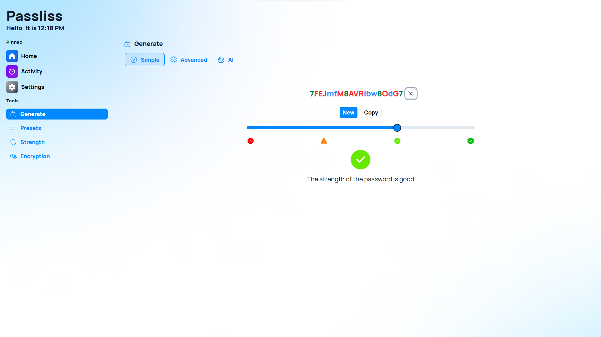
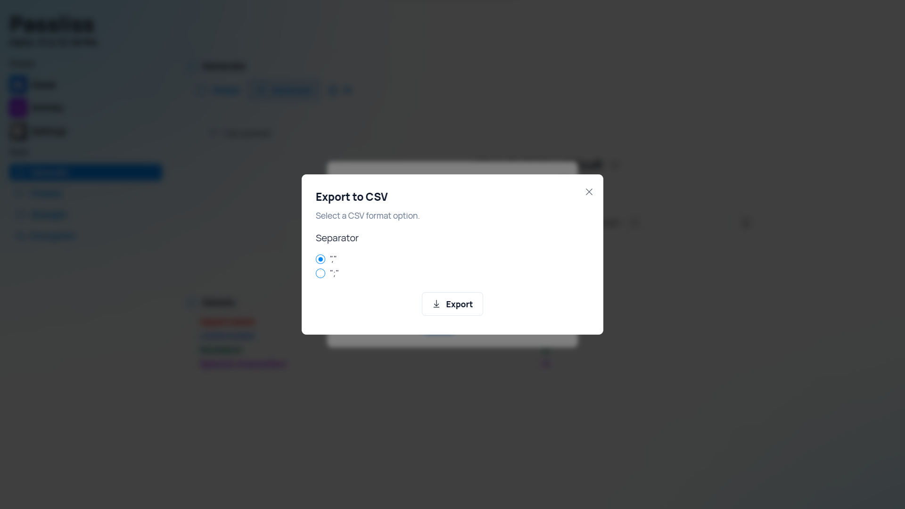

A new version of Passliss is now available, and it is the version 4.2.0.2405. This version brings several new additions and improvements to the app, notably the new Advanced Vision feature.

## Advanced vision

Passliss, the user-friendly password generator web app, has elevated its functionality with the introduction of an innovative advanced vision feature. This novel addition empowers users with a visual understanding of their passwords like never before. By simply toggling the "eye" icon adjacent to the password field, Passliss reveals a vibrant color code that highlights the distinct characters within the generated password. From uppercase letters to lowercase, numbers, and special symbols, each character type is visually distinguished, aiding users in crafting robust and secure passwords with ease.

## New CSV Export options

When exporting multiple passwords to CSV, you can now specify the format to use: comma `(,)` or semicolon `(;)`.

## Changelog

### New

- Added a link to Presets page in Generate page (#1024)
- Added translations (#1025)
- Added new options to CSV export feature (#1025)
- Added Advanced vision feature (#1026)
- Added Advanced vision to "Simple" view (#1026)
- Added a tooltip to Advanced vision button (#1026)
- Added Advanced Vision to Home page (#1026)

### Fixed

- Fixed alignment issue in Home page

### Updated

- _Updated dependencies_
- Upgraded home page

## Launch

[Click here](https://passliss.leocorporation.dev/) to launch Passliss in your web browser.

## Learn more

[Click here](https://leocorporation.dev/store/passliss) to learn more about Passliss
