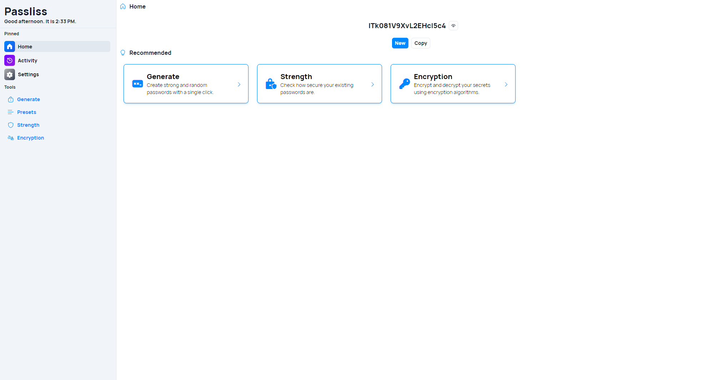
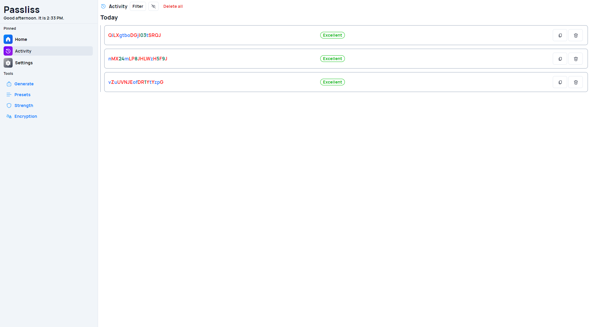

A new version of Passliss is now available, and it is the version 4.3.0.2407. This version brings several new additions and improvements to the app, such as the new navigation bar design.

## New navbar design

Starting with this version, we are introducing a new layout for Passliss. We redesigned the navbar and removed the mesh gradient background to make the app cleaner and look nicer on all devices. The navbar also has a different tinted color to make it more noticeable on desktop. Please note that isn't a complete revolution but rather an improvement of the existing design.

## New Advanced vision option in Activity

We also added the new Advanced vision option to the Activity page, so you can quickly see the different characters types that are included in your password.

## Changelog

### New

- Export button is now visible only if presets exists (#1136)
- Added advanced vision in Activity page (#1137)
- Added button to generate new password prompts in AI page (#1138)
- Added french prompts suggestions (#1138)
- Added new navbar button styles (#1139)
- Added new background (#1139)
- Added new navbar design (#1139)

### Fixed

- Fixed Tailwind issues

### Updated

- _Updated dependencies_
