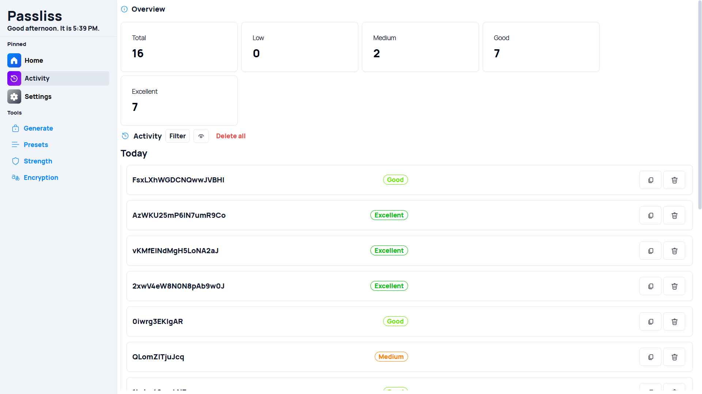
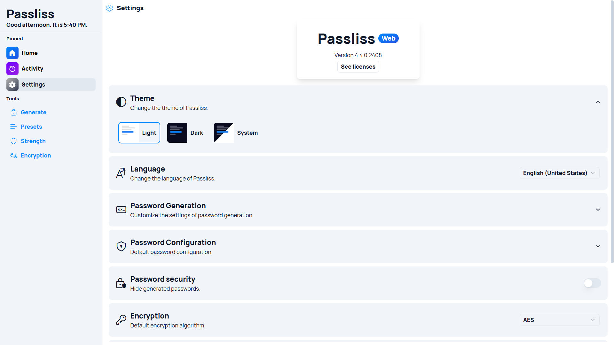

A new version of Passliss is now available, and it is the version 4.4.0.2408. This update brings small improvements and new UI improvements.

## Enhanced User Interface and Experience

The latest version of Passliss introduces a range of features aimed at enhancing the overall user interface and experience. Indeed, the Activity tab now includes an Overview section, providing users with a clear and concise summary of their recent activities, making navigation more intuitive.

## Improved Customization and Visuals

Customization and visual appeal have also received attention in this update. A marker has been added in the Theme section, allowing users to easily identify and select their preferred themes. The design of the Select component has been updated, alongside a new tooltip design, both of which contribute to a more polished and visually consistent user interface.

## New Functionalities and Integrations

This update also brings new functionalities that improve the app's integration and management capabilities. Users can now view the OpenAI API Key directly within the app, simplifying the process of managing integrations. Additionally, a GitHub link has been added to the "See Licenses" dialog, providing quick access to the app’s licensing information and contributing to a more transparent user experience.

## Changelog

### New

- Added a marker in Theme section in Settings (#1190)
- Added a GitHub link in "See Licenses" dialog (#1191)
- Added the possibility to view the OpenAI API Key (#1192)
- Added Card component (#1193)
- Added locales (#1193)
- Added Overview section in Activity (#1193)
- Added mobile layout (#1193)
- Added new Select component design
- Added new tooltip design

### Updated

- Redesigned Activity items
- _Updated dependencies_

## Launch

[Click here](https://passliss.leocorporation.dev/) to launch Passliss in your web browser.

## Learn more

[Click here](https://leocorporation.dev/store/passliss) to learn more about Passliss
